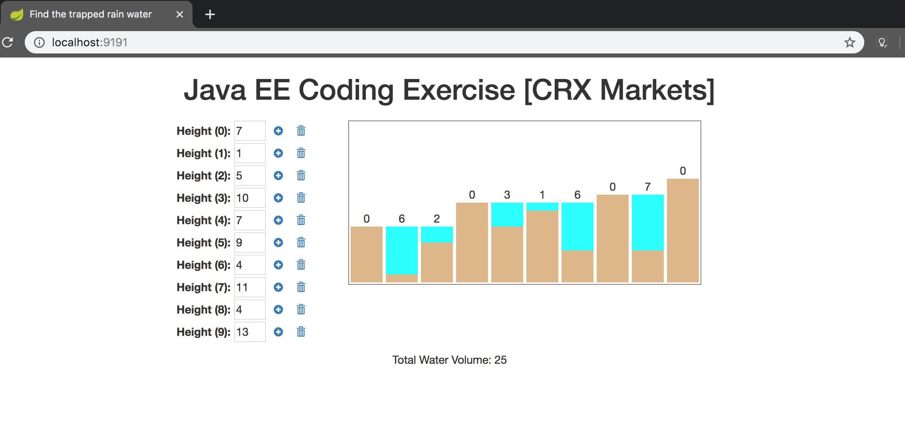

# crx-markets

This is a multi module maven application, with ... 
- **crx-api** defining api contracts and response DTOs.
- **crx-web** a spring boot web application providing api implementation and a homepage accessing API endpoint. UI is written in AngularJs. (I would have 2 separate applications, one for web and other serving API. I combined both into one for convenience.)

**Note:** I do not have practice writing too many comments. This time I added them only to help puzzle review go smooth.

## How to build and run:
```
- mvn clean install
- cd crx-web
- mvn spring-boot:run
- OR java -jar target/crx-web-0.0.1-SNAPSHOT.jar
```
A web application listening on port 9191 is started.

### Accessing via web-ui:

Launch http://localhost:9191

With web ui you can test algorithm by inputting surface profile and pictorially depicting the water trapped in hole. 
I am not into UI, so please consider this as an unasked feature and not a fully functional and fully tested web interface.
One can expect upto 10 values without breaking the layout plotted on the screen.



### Accessing via curl:

Request: ```curl -XPOST -H 'Content-Type: application/json' --data '[7, 4, 3, 11, 8, 9, 6, 4, 5, 7, 6, 10]' 'localhost:9191/v1/api/algorithm/find-water-volume'```

Response: {"volume":32}

Following end point is supposed to be exposed to only web-ui, but available with curl too.

Request: ```curl -XPOST -H 'Content-Type: application/json' --data '[7, 4, 3, 11, 8, 9, 6, 4, 5, 7, 6, 10]' 'localhost:9191/www/algorithm/find-water-summary'```

Response: {"total":32,"volume":[0,3,4,0,2,1,4,6,5,3,4,0]}

## Algorithm:

The requirement is to return sum of trapped water at each hole, but I have changed it bit to return the array instead of sum of the array to let web ui plot a graph of its own, thus I am providing 2 solutions, one to meet the requirements and the other to provide an additional feature by me very own.

- TrappedWaterVolumeProcessor (returns volume)
- TrappedWaterDetailedProcessor (returns array of water at each hole)

I could have used same algorithm to produce results for both purposes, but then took this opportunity to provide 2 different solutions.

My ultimate choice is though **TrappedWaterDetailedProcessor** as a simple, lean solution.

## Things to improve:

1. Tests: I donot claim to have 100% test coverage, not all classes are covered with tests. Assumption is to demonstrate testability with one or more tests for main business classes.
2. Domain: As the requirements do not specifically mentions any domain, I considered 'algorithm' as domain and accordingly designed classes. 
Plus there are chances of having security (authorization), repository in a standard web application, which I excluded considering given context. 
My only point here is I considered possibilities, but restricted myself to very specific requirements, with open capability of extension.
